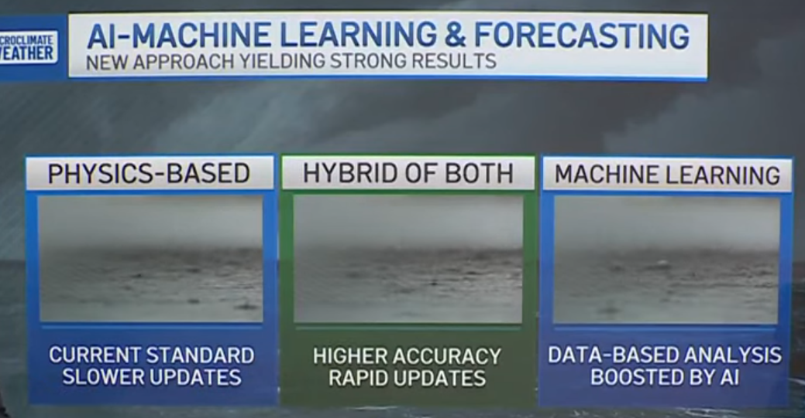
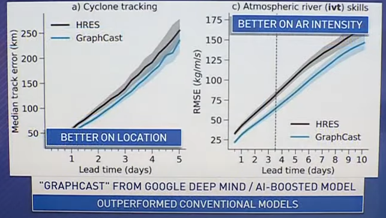

---
date:
  created: 2024-07-23
categories:
  - Machine Learning
tags:
  - Data
  - ML
---

# ML on the weather news channel
I came upon a news video talking about weather forecast and the effect of Machine Learning on the speed and accuracy of ML compared to traditional weather model (I'm guessing numerical physics model). I gotta say I'm quite impressed by how popular ML is getting especially getting a piece on the news. 

{ width="500" }

The ML model is also found to outperform the conventional models. However ML model does require more data. 

{ width="500" }

Source: [How AI is chaning the game for weather forcasting](https://www.youtube.com/watch?v=dj60_4QNEew)

Github: [Graphcast](https://github.com/google-deepmind/graphcast)