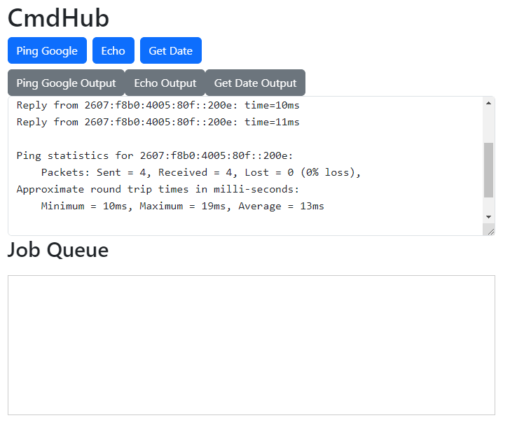

---
date:
  created: 2024-07-31
categories:
  - Flask
tags:
  - Flask
---

# Command Hub (cmdhub)
I always wanted to build a minimal workflow automation UI where you have some predefine buttons which execute certain commands that you define in a text files. There are existing tools such as Jenkins and Rundeck that offer similar capabilities. However I'd like something custom to my need in a compact format, i.e execute commands/python scripts, display the text output all in 1 page.

To get started I asked ChatGPT to give a directory structure of such application using Flask and HTML/Javascript. I gotta say it got very close to what I need after a few hours of iterations. I'm too knowledgable in HTML and Javascript, but ChatGPT help me tremendously by saving time to google search. 

Source: [cmdhub](https://github.com/rigidlab/cmdhub/)

{ width="500" }

After this, I feel the prospect of generative AI world is exciting yet scary. At this pace, when will machines replace human in white collar jobs ?