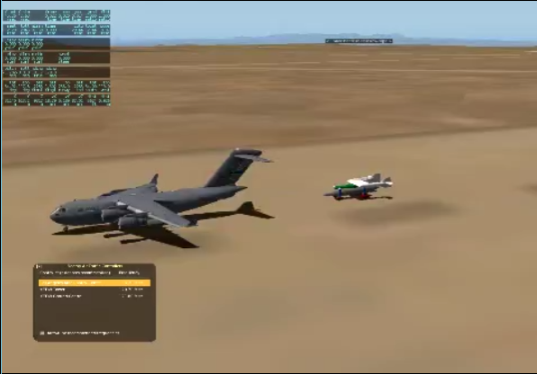

---
hide:
  - navigation
---

# rigidlab {: .visually-hidden }
Highlights:

-   

    ---

    **[qtxterm](projects/index.md#qtxterm)**

    Cross-platform terminal built with Qt(PySide6) and xterm.js.

-   

    ---

    **[wanderlust](projects/index.md#wanderlust)**

    A photobook of my hiking trips, built with Astro.

-   

    ---

    **[Towed Aircraft Simulation](projects/index.md#towed-aircraft-simulation)**

    Airlaunch concept simulated in X-Plane, flown by a Python autopilot over UDP.

