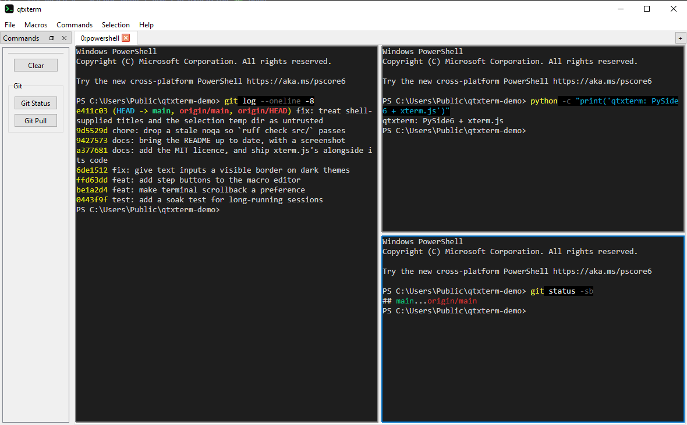
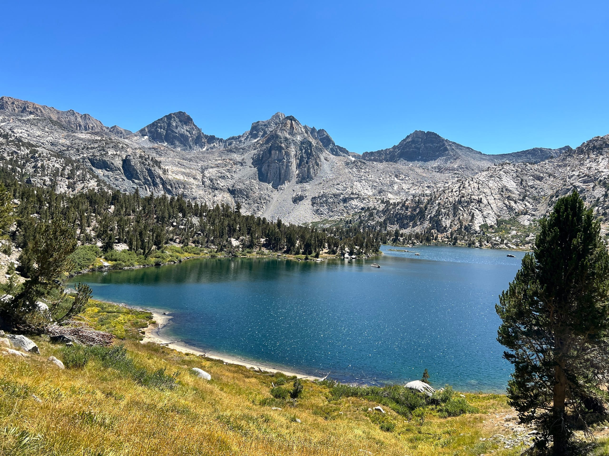

# Projects {: .no-present }

Building software for robotics, finance, and whatever's bugging me that day.

## qtxterm

A cross-platform tabbed terminal (Windows, Linux and Mac) built with Qt
PySide6, rendering terminals via embedded [xterm.js](https://xtermjs.org/) in
a `QWebEngineView`.

### Features

- Tabs and split panes, moveable within or out of a tab, with tmux-style labels
- Any shell on the box — PowerShell, Command Prompt, Git Bash, or a specific
  WSL distro, discovered at runtime
- Commands and multi-step macros that open their own tabs and split panes
- Selection actions that send selected text to a search URL or a command on
  stdin, without shell interpolation
- Browser tabs and panes alongside terminals
- Themes and typography applied to both the terminal and window chrome

Source: [github.com/rigidlab/qtxterm](https://github.com/rigidlab/qtxterm)

---

## wanderlust

A photobook of my hiking trips on the web, in the visual language of
Gestalten's *Wanderlust: Hiking on Legendary Trails*. Static site built with
Astro, one chapter per trail.

Every chapter reads two ways from the same content: a full-viewport "book"
view (arrow keys / swipe) with two-page spreads in landscape, and a
long-form scrolling view for skimming.

Live site: [rigidlab.github.io/wanderlust](https://rigidlab.github.io/wanderlust/)

Source: [github.com/rigidlab/wanderlust](https://github.com/rigidlab/wanderlust)

---

## Towed Aircraft Simulation

Simulation of a novel airlaunch concept in X-Plane, with an automatic
take-off and control system driven from Python over UDP.

<video controls preload="metadata" width="500" poster="posts/xplane/towed_aircraft_sim.png">
  <source src="posts/xplane/towed_aircraft_sim.mp4" type="video/mp4">
  Your browser does not support the video tag.
</video>
