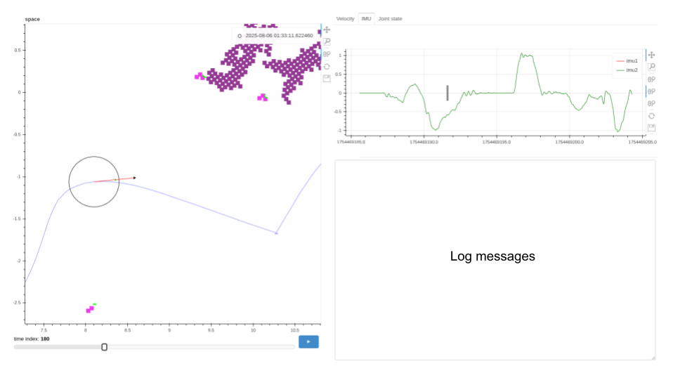

# Projects

## Stocks
Stocks:  
- Data Download as my own point in time database  
- Analysis and Visualization  
- Strategies Backtest  
- Data Source: Yahoo Finance  

Source: [https://github.com/rigidlab/stocks](https://github.com/rigidlab/stocks)  
Docs: [https://rigidlab.github.io/stocks](https://rigidlab.github.io/stocks)   
Demo: 

---

## Visualization of rosbags and logs with Bokeh
{ width="500" }

**What you're seeing**  
1. A static HTML rendering of a rosbag using Bokeh (Pose, Occupancy Grid, IMU, Lidar)  
2. Slider with play button to enable playing back a bag file slice by slice  
3. Time series data and log messages on one side to review  

---

## Towed Aircraft Simulation using X-Plane and Python
<video controls preload="metadata" width="500">
  <source src="towed_aircraft_sim.mp4" type="video/mp4">
  Your browser does not support the video tag.
</video>

**What you're seeing**  
1. Simulation of a novel Airlaunch concept in X-Plane  
2. Automatic take off and control system using Python via UDP communication with X-Plane  
