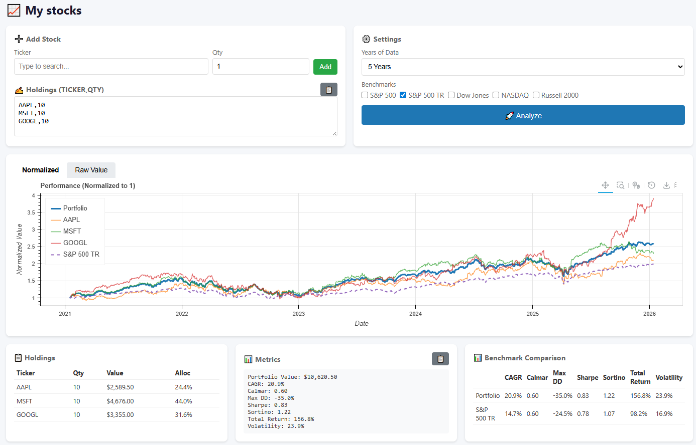

---
date:
  created: 2026-01-13
categories:
  - Finance
tags:
  - Stocks

---
# Stocks Analysis on replit
## Motivation
I've always wanted an app to help me with portfolio optimization, using yfinance as the data source and bokeh as visualization library. With the abundance of replit ads shown online, I decided to give it a try. This cost 40$ and about 4 hours of tinkering on replit. This would have taken me more than that programming from scratch (Probably at least a whole weekend of tinkering with Bokeh and HTML/Javascript to get it to right look)

<!-- more -->
## Result

Result: [https://mystocks.replit.app](https://mystocks.replit.app)

