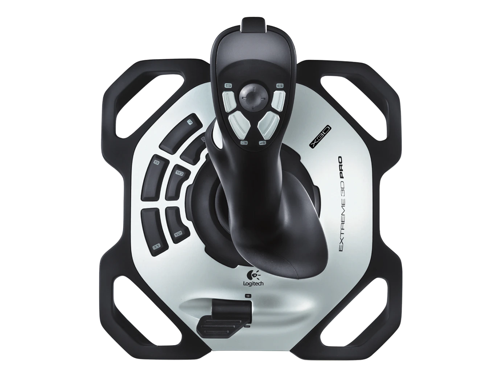

To write a ROS package involve quite a few files and the package directory require to meet a certain structure. For my use cases, I typically just need a standalone Python script. And thus I'm collecting these useful scripts in this repo: [ros_tools](https://github.com/rigidlab/ros_tools)

Here are some highlights:

## Squirtle Sim

## Teleop Twist Console

## Teleop Twist Joystick
### Intro
Developing a configurable joystick ROS app: 

- Robot Operating System (ROS)
- For [Twist](https://docs.ros.org/en/noetic/api/geometry_msgs/html/msg/Twist.html) controlled robots
- Using Logitech Extreme3d Pro Joystick

{ width="300" }

### Reference
* [teleop_twist_keyboard](https://github.com/ros-teleop/teleop_twist_keyboard)
* [teleop_twist_joy](https://github.com/ros2/teleop_twist_joy)